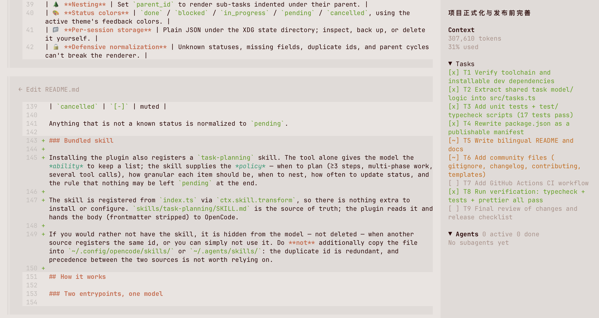

# opencode2-tasks

**A Tasks panel for OpenCode V2 — a `tasks` tool the agent can call, plus a live, nestable task list in the TUI sidebar.**

[](https://github.com/smallnest/opencode2-tasks/actions/workflows/ci.yml)
[](https://www.npmjs.com/package/opencode2-tasks)
[](./LICENSE)
[](./package.json)

**English** · [简体中文](./README_CN.md)



## Overview

Long agent runs are easier to follow when the plan is visible. OpenCode ships a session task tool, but the state only lives in the transcript. This plugin makes the plan **durable and glanceable**:

- **Server entrypoint (`index.ts`)** registers a `tasks` tool. The agent sends the complete list on every call; the plugin validates it and writes it to disk per session.
- **TUI entrypoint (`tui.tsx`)** reads those files and renders them in the OpenCode sidebar (`sidebar.content`), with indentation for sub-tasks, per-status markers, and theme colors.

Both entrypoints load in different runtimes, so they share a single dependency-free model module (`src/tasks.ts`) and cannot disagree about the on-disk format.

```
┌──────────────────────────────┐        ┌──────────────────────────────┐
│  OpenCode server (agent)     │        │  OpenCode TUI (sidebar)      │
│                              │        │                              │
│  tasks tool ──► normalize ───┼──┐  ┌──┼──► flatten ──► <Tasks />     │
└──────────────────────────────┘  │  │  └──────────────────────────────┘
                                  ▼  │
                    $XDG_STATE_HOME/opencode-tasks/<session>.json
```

## Features

| Feature | Description |
| --- | --- |
| 🧩 **`tasks` tool** | One call replaces the whole list, so the model never has to diff or delete. |
| 🧭 **Bundled skill** | Ships a `task-planning` skill so the model plans on its own instead of waiting to be asked. |
| 🌲 **Nesting** | Set `parent_id` to render sub-tasks indented under their parent. |
| 🎨 **Status colors** | `done` / `blocked` / `in_progress` / `pending` / `cancelled`, using the active theme's feedback colors. |
| 📁 **Per-session storage** | Plain JSON under the XDG state directory; inspect, back up, or delete it yourself. |
| 🔒 **Defensive normalization** | Unknown statuses, missing fields, duplicate ids, and parent cycles can't break the renderer. |
| 🗂️ **Collapsible panel** | Click the `Tasks` header to fold the section, matching the built-in MCP block. |
| ⚡ **No build step** | Ships as TypeScript sources; OpenCode loads them directly. |

## Requirements

- **OpenCode V2** (developed against `v2.0.18`).
- **Node.js ≥ 22.18** for development (type stripping + the built-in test runner).
- `XDG_STATE_HOME` is honored; on macOS/Linux without it, state goes to `~/.local/state`.

## Installation

### With the OpenCode CLI

```bash
opencode plugin add opencode2-tasks   # install and write the global configuration
opencode reload                       # apply it without restarting the service
```

`opencode plugin add` targets the **global** configuration, so the plugin becomes available in every project. To enable it for one project only, add it to that project's `opencode.json(c)` by hand instead (see below).

The rest of the subcommands:

```bash
opencode plugin list                        # what is loaded, and from where
npm view opencode2-tasks version            # find the latest version
opencode plugin add opencode2-tasks@x.y.z   # pin an exact version
opencode plugin check                       # is a newer version available?
opencode plugin update                      # upgrade to the latest
opencode plugin remove opencode2-tasks      # uninstall
```

The `./tui` export is discovered automatically, so the sidebar panel loads with the same entry.

### By editing the configuration

```jsonc
// ~/.config/opencode/opencode.jsonc  (global)  or  ./opencode.jsonc  (project)
{
  "$schema": "https://opencode.ai/config.json",
  "plugins": ["opencode2-tasks"] // append "@x.y.z" to pin a version
}
```

If you use OpenCode against a **remote server**, also register the package in the CLI-only configuration so the panel keeps working locally:

```jsonc
// ~/.config/opencode/cli.json
{
  "$schema": "https://opencode.ai/v2/cli.json",
  "plugins": ["opencode2-tasks"]
}
```

### From a local checkout

```jsonc
{
  "plugins": ["/absolute/path/to/opencode2-tasks"]
}
```

Register either the published package **or** a local checkout, never both: the plugin would load twice, registering the `tasks` tool and the `task-planning` skill twice each.

Then apply the change with `opencode reload`, or restart the service (`opencode service restart`) if you edited the configuration while it was running.

## Usage

Once installed, the agent gets a `tasks` tool. A single call replaces the entire list:

```json
{
  "tasks": [
    { "id": "T1", "status": "in_progress", "summary": "Model the task store" },
    { "id": "T1.1", "parent_id": "T1", "status": "done", "summary": "Normalize tool input" },
    { "id": "T1.2", "parent_id": "T1", "status": "pending", "summary": "Add cycle protection" },
    { "id": "T2", "status": "blocked", "summary": "Wait for review" }
  ]
}
```

The sidebar then shows:

```
▼ Tasks
[~] T1 Model the task store
[x]   T1.1 Normalize tool input
[ ]   T1.2 Add cycle protection
[!] T2 Wait for review
```

### Tool schema

| Field | Type | Required | Description |
| --- | --- | --- | --- |
| `tasks` | `array` | ✅ | The **complete** list. It replaces the previous one. |
| `tasks[].id` | `string` | ✅ | Short unique id, e.g. `T1` or `T1.1`. |
| `tasks[].status` | `string` | ✅ | One of `pending`, `in_progress`, `blocked`, `done`, `cancelled`. |
| `tasks[].summary` | `string` | ✅ | One-line description. |
| `tasks[].parent_id` | `string` | | Parent task id for nesting; empty or omitted for a top-level task. |

### Status reference

| Status | Marker | Color |
| --- | --- | --- |
| `pending` | `[ ]` | muted |
| `in_progress` | `[~]` | warning |
| `blocked` | `[!]` | error |
| `done` | `[x]` | success |
| `cancelled` | `[-]` | muted |

Anything that is not a known status is normalized to `pending`.

### Bundled skill

Installing the plugin also registers a `task-planning` skill. The tool alone gives the model the *ability* to keep a list; the skill supplies the *policy* — when to plan (≥3 steps, multi-phase work, several tool calls), how granular each item should be, when to nest, how often to update status, and the rule that nothing may be left `pending` at the end.

The skill is registered from `index.ts` via `ctx.skill.transform`, so there is nothing extra to install or configure. `skills/task-planning/SKILL.md` is the source of truth: the plugin reads it at startup and hands its body (frontmatter stripped) to OpenCode.

Do **not** also copy the file into `~/.config/opencode/skills/` or `~/.agents/skills/`. Both sources would define the same skill id, and which one wins depends on registration order — pointless ambiguity for identical content.

## How it works

### Two entrypoints, one model

```
index.ts ─┐                      ┌─ OpenCode server runtime  (tool + skill)
          ├── src/tasks.ts ─────┤
tui.tsx  ─┘                      └─ OpenCode TUI runtime      (sidebar panel)
```

- `src/tasks.ts` and `src/skill.ts` hold the types, storage paths, and pure helpers (`normalizeTasks`, `flattenTasks`, `parseSkillDocument`). Neither has **any OpenCode import**, so both are trivially unit-testable.
- `index.ts` imports them and registers the `tasks` tool plus the bundled skill. It imports `@opencode/plugin` with `import type` only, because the server runtime resolves that specifier itself; the import is erased at load time and the exported object already matches the `{ id, setup }` contract.
- `tui.tsx` imports the model and renders the panel. It polls the state directory every 1.5 s (the sidebar renders synchronously while the tool writes from another process) and returns a cleanup function that stops the timer. Clicking the section header re-reads immediately, so expanding never shows a stale snapshot.

See [`docs/architecture.md`](./docs/architecture.md) for the full design notes.

### Storage

```
$XDG_STATE_HOME/opencode-tasks/<url-encoded-session-id>.json
# or, when XDG_STATE_HOME is unset:
~/.local/state/opencode-tasks/<url-encoded-session-id>.json
```

Each file is a JSON array of tasks:

```json
[
  { "id": "T1", "parent_id": null, "status": "in_progress", "summary": "Model the task store" }
]
```

Files are written atomically enough that a half-written file is skipped by the reader. Task ids are `encodeURIComponent`-escaped so they are safe as filenames.

### Session scope

The task list is **per session**, and the panel shows only the current session's list:

- Each session has its own file, named after its session id. Opening a new session starts from an empty list — nothing carries over from the session you were in before.
- The `Tasks` section stays hidden while the current session has no tasks, and appears as soon as the agent writes some. It disappears again if the list is cleared.
- The panel mirrors **every** session's list into memory, so switching sessions re-renders instantly without waiting for a re-read. The background poll and the click-to-refresh keep those mirrored lists current.
- Deleting one session's file affects only that session.

## Development

```bash
npm install          # install dev dependencies
npm test             # run the unit tests (node:test)
npm run typecheck    # tsc --noEmit
npm run format       # prettier --write .
npm run check        # typecheck + format check + tests (what CI runs)
```

### Project layout

```
.
├── index.ts                 # server entrypoint: registers the `tasks` tool + skill
├── tui.tsx                  # TUI entrypoint: renders the sidebar panel
├── src/
│   ├── tasks.ts             # shared model, storage paths, pure helpers
│   └── skill.ts             # SKILL.md frontmatter/body parser
├── skills/
│   └── task-planning/
│       └── SKILL.md         # the planning skill registered at startup
├── test/
│   ├── tasks.test.ts        # unit tests for the pure helpers and storage
│   └── skill.test.ts        # unit tests for the skill parser
├── docs/
│   ├── architecture.md      # deeper notes on the two-runtime design
│   └── screenshot.png       # the panel in a real session
├── .github/                 # CI workflow, issue and PR templates
├── package.json
├── tsconfig.json
├── CHANGELOG.md
├── CONTRIBUTING.md
└── LICENSE
```

### Verifying the plugin locally

After adding the checkout to `plugins`, restart OpenCode and ask the agent to update its task list. The sidebar should show the `Tasks` section. You can also inspect the raw state:

```bash
cat "${XDG_STATE_HOME:-$HOME/.local/state}/opencode-tasks/"*.json
```

## Troubleshooting

**The panel doesn't appear.**
The `Tasks` section only renders when the current session has at least one task. Ask the agent to call the `tasks` tool, then wait one refresh interval (1.5 s). Restart the service after changing `plugins`: `opencode service restart`.

**The panel shows stale data.**
The TUI re-reads the state directory every 1.5 s, and clicking the `Tasks` header re-reads immediately — so if you edited a task file by hand, expand the section (or wait one interval) to pick it up.

**The `Tasks` section shows fewer rows than expected.**
A task file that is unreadable or half-written is skipped rather than blanking the panel, and rows only appear for the session you are looking at. Run `cat "${XDG_STATE_HOME:-$HOME/.local/state}/opencode-tasks/"*.json` to check what is actually stored.

**`Cannot find module '@opencode/plugin'`.**
That import is type-only inside `index.ts`, so it is erased at runtime. If you see this from `tui.tsx`, your OpenCode build does not resolve `@opencode/plugin/tui`; upgrade to a build that does, or pin a compatible version.

**The `task-planning` skill is listed twice, or not at all.**
It should come from the plugin only. Check for a hand-made copy or symlink under `~/.config/opencode/skills/`, `~/.agents/skills/`, or `.opencode/skills/` and remove it. If it is missing entirely, the packaged `skills/` directory was not installed — reinstall without a `files` filter, or copy `skills/task-planning/SKILL.md` into one of those discovery directories as a fallback.

## Contributing

Issues and pull requests are welcome — see [CONTRIBUTING.md](./CONTRIBUTING.md) and the [Code of Conduct](./CODE_OF_CONDUCT.md). Run `npm run check` before opening a PR.

## Changelog

See [CHANGELOG.md](./CHANGELOG.md).

## License

[MIT](./LICENSE) © 2026 smallnest
